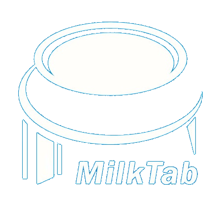
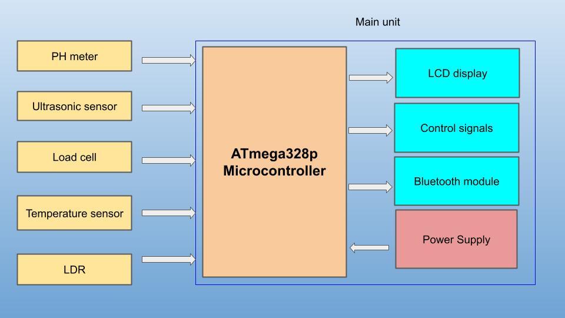
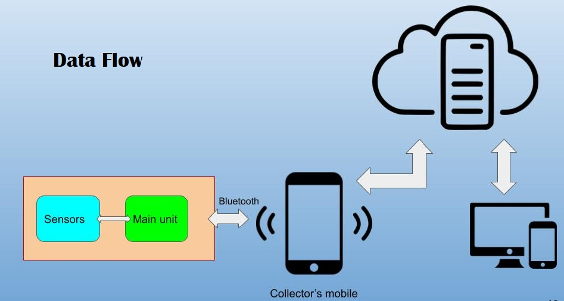

[//]: # (Please refer the instructions in below URL for the configurations)
[//]: # (https://projects.ce.pdn.ac.lk/docs/how-to-add-a-project)

# Healthy-Milk-Collecting-System

## Description

Quality is very important in diary related products.
Currently diary collectors measure only few parameters using technology while small scale manufacturers just use organoleptic tests for checking the milk quality. Also the financial deals are happening in a traditional way.
Our Healthy Milk Collecting System can be used to measure important quality parameters of milk when the deal happens between diary collector and farmer to ensure the milk is healthy and also it can be used to calculate financial value of milk according to those parameters and manage the financial system in a cloud based system.

## Our solution

```
- Easy usage
- portable
- Low cost
- Reachargable & Low power consumption
```
## Solution Architecture



## Team Members
1. E/17/012 Amarasinghe R A A U [[Website](http://www.ce.pdn.ac.lk/e17-batch/), [Email](mailto:e17012@eng.pdn.ac.lk)]
2. E/17/038 Chandrasekara C M A [[Website](http://www.ce.pdn.ac.lk/e17-batch/), [Email](mailto:e17038@eng.pdn.ac.lk)]
3. E/17/101 Gunathilaka S P A U [[Website](http://www.ce.pdn.ac.lk/e17-batch/), [Email](mailto:e17101@eng.pdn.ac.lk)]


## Supervisors
1. Dr. Isuru Nawinne [[Website](http://www.ce.pdn.ac.lk/academic-staff/isuru-nawinne/), [Email](mailto:isurunawinne@eng.pdn.ac.lk)]
2. Dr. Mahanama Wickramasinghe [[Website](http://www.ce.pdn.ac.lk/2021/05/02/dr-mahanama-wickramasinghe/), [Email](mailto:mahanamaw@eng.pdn.ac.lk)]


## Links

1. [Project page](https://cepdnaclk.github.io/e17-3yp-Healthy-Milk-Collecting-System/)
2. [Github repo](https://github.com/cepdnaclk/e17-3yp-Healthy-Milk-Collecting-System)
3. [Department of computer engineering](http://ce.pdn.ac.lk)


## Publications
1. [Semester 7 report](https://cepdnaclk.github.io/e15-4yp-minimal-template)
2. [Semester 7 sldies](https://cepdnaclk.github.io/e15-4yp-minimal-template)
3. [Semester 8 report](https://cepdnaclk.github.io/e15-4yp-minimal-template)
4. [Semester 8 slides](https://cepdnaclk.github.io/e15-4yp-minimal-template)
5. Author1, Author2 and Author2 "Research paper title" in Conference name 2021. [Download PDF ](https://cepdnaclk.github.io/e15-4yp-minimal-template)
